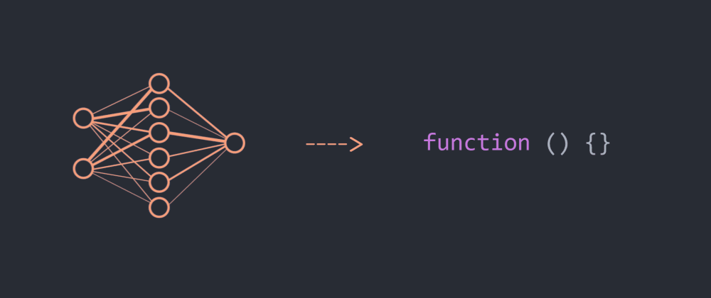

    

 

 <h1>Hello, I´m Sebastián Sanhueza✌️</h1>

 

    
    

 I am an undergraduate student in Civil Electrical Engineering and an aspiring Master's student in Data Science at the University of Chile, hoping to graduate in 2025🙏. 

##   About me 

 

<picture> </picture>

- 🔭 My main interests are Machine Learning, Deep Learning and Data Science.
- 🌱 I am currently expanding my knowledge in Deep Learning by studying Deep Generative Modelling.
- 👯 I seek to apply my knowledge in the areas of astronomy and health.
- 😄 Pronouns: 𝙷𝚎/𝙷𝚒𝚖/𝙷𝚒𝚜.
- ⚡ Fun fact: I play the drums, I love cats and my favourite manga is One Piece.

 

##  Skills
 

- **Languages**:

- **Data Analytics and Machine Learning Frameworks**:

- **Database**:

  
 

- **Tools and Technologies**:

    

