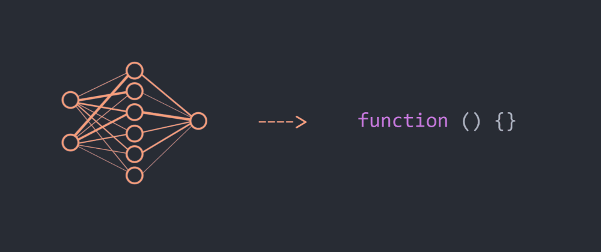

    

 

 
    <h1>Hello, I´m Sebastián Sanhueza ⚡</h1> 
    
<b>Electrical Engineer | Machine Learning & Data Science Enthusiast</b>
 

    
    

    🎓 Electrical Engineer from the University of Chile. 
     
    Passionate about extracting insights from data and building scalable Machine Learning solutions to solve complex real-world problems.

---

##  About Me

<picture> 
    
</picture>

- 🚀 **Profession**: Electrical Engineer with a strong background in analytical modeling and data-driven decision making.
- 🔭 **Current Focus**: Developing end-to-end Data Science projects, from data cleaning and exploration to model deployment.
- 🌱 **Skills**: Statistical Analysis, Supervised/Unsupervised Learning and Predictive Modeling.
- ☁️ **Cloud Computing**: Experience in **training and modeling** predictive solutions using **Azure Machine Learning**.
- ⚡ **Fun fact**: I'm a drummer, cat lover, and a massive One Piece fan 🏴‍☠️.

 

## 🛠️ Skills & Toolbox

### 💻 Languages & Databases

### 📊 Data Science & AI Frameworks

### 🔧 Tools

 

    

